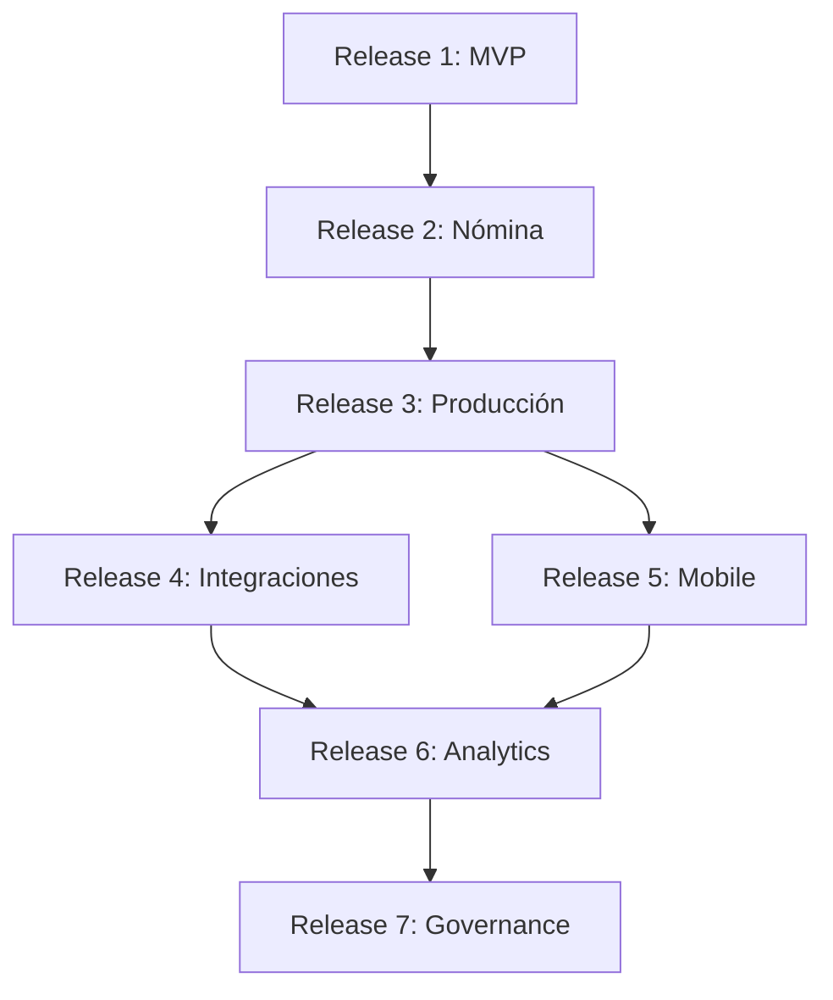

# ROADMAP TÉCNICO - TalentoNet

## 🎯 RELEASE 1: MVP Técnico (Sprint 1-4, ~8 semanas)

### Objetivo
Infraestructura base, autenticación, CRUD empleados, storage, CI/CD funcional en ambiente de desarrollo.

### Features Incluidas

#### Sprint 1-2: Fundación
- [x] Setup monorepo con pnpm workspaces
- [x] Configuración TypeScript backend + frontend
- [x] Base de datos PostgreSQL con migraciones TypeORM
- [x] Esquema inicial (users, roles, employees, contracts)
- [x] Docker Compose para desarrollo local
- [x] CI pipeline básico (lint + test)

#### Sprint 3-4: Core MVP
- [x] Autenticación JWT (login, /me, refresh)
- [x] Guards de roles (admin, rh, employee)
- [x] CRUD completo de empleados con validaciones
- [x] Endpoints REST documentados con Swagger
- [x] Frontend: Lista y formulario de empleados
- [x] Integración React Query para cache
- [x] Storage S3 con presigned URLs (MinIO dev)
- [x] RabbitMQ para eventos asíncronos
- [x] Tests unitarios + e2e básicos

### Entregables Release 1
- ✅ Aplicación deployable en Docker Compose
- ✅ API REST funcional con autenticación
- ✅ Frontend SPA con componentes base
- ✅ CI ejecutándose en GitHub Actions
- ✅ Documentación README y API Docs

### Criterios de Aceptación
- [ ] Usuario RH puede hacer login
- [ ] Usuario RH puede crear/editar/desactivar empleados
- [ ] Empleado puede ver su perfil
- [ ] Tests pasan al 100% en CI
- [ ] Aplicación levanta con `docker-compose up`

---

## 🚀 RELEASE 2: Nómina y Seguridad Social (Sprint 5-8, ~8 semanas)

### Objetivo
Cálculo básico de nómina, afiliaciones, integraciones con Yéminus (stub), generación de PDFs.

### Features Incluidas

#### Sprint 5-6: Nómina Base
- [ ] CRUD de contratos laborales
- [ ] CRUD de afiliaciones (EPS, AFP, ARL)
- [ ] Cálculo de nómina mensual con deducciones básicas
  - Salud 4%, Pensión 4%
  - Parametrización de SMLV y auxilio transporte
- [ ] Aprobación de nómina (workflow básico)
- [ ] Histórico de nóminas por empleado
- [ ] Frontend: Vistas de nómina y contratos

#### Sprint 7-8: Integraciones y Reports
- [ ] Integración Yéminus para afiliaciones (stub funcional)
  - Retry con backoff exponencial
  - Dead letter queue para fallos
- [ ] Generación de desprendibles de pago en PDF
  - Template HTML con Puppeteer
  - Almacenamiento en S3
  - Download seguro con presigned URL
- [ ] Exportación archivo plano PILA (formato básico)
- [ ] Reportes básicos: nómina mensual, empleados activos
- [ ] Auditoría de operaciones críticas

### Entregables Release 2
- ✅ Cálculo de nómina funcional (básico)
- ✅ Generación de PDF desprendibles
- ✅ Integración Yéminus (stub con retry)
- ✅ Archivo PILA exportable
- ✅ Auditoría completa

### Criterios de Aceptación
- [ ] RH puede calcular y aprobar nómina mensual
- [ ] Empleado puede descargar desprendible en PDF
- [ ] Sistema envía afiliaciones a Yéminus (stub) con reintentos
- [ ] Se genera archivo PILA formato texto
- [ ] Todas las operaciones quedan en audit log

---

## 🔥 RELEASE 3: Hardening y Producción (Sprint 9-12, ~8 semanas)

### Objetivo
Cálculos avanzados, reportes ejecutivos, seguridad reforzada, performance, deploy a producción.

### Features Incluidas

#### Sprint 9-10: Cálculos Avanzados
- [ ] Retención en la fuente (tablas DIAN 2024)
- [ ] Aportes parafiscales (SENA, ICBF, Cajas)
- [ ] Prestaciones sociales (cesantías, intereses, prima)
- [ ] Horas extras y recargos nocturnos
- [ ] Bonificaciones y comisiones
- [ ] Novedades de nómina (licencias, incapacidades, vacaciones)
- [ ] Liquidación de contratos (finiquitos)

#### Sprint 11: Reportes y Analytics
- [ ] Dashboard ejecutivo con KPIs
  - Empleados activos/inactivos
  - Nómina total mensual
  - Distribución por departamento/ciudad
- [ ] Reportes avanzados exportables (Excel, PDF)
  - Nómina consolidada
  - Provisiones prestaciones sociales
  - Certificados laborales
- [ ] Gráficos y visualizaciones (Chart.js)
- [ ] Filtros dinámicos y búsqueda avanzada

#### Sprint 12: Producción Ready
- [ ] Optimización de performance
  - Índices de base de datos
  - Cache Redis para queries frecuentes
  - Lazy loading en frontend
  - Pagination optimizada
- [ ] Seguridad reforzada
  - Rate limiting avanzado
  - CORS configurado
  - Helmet + CSP headers
  - Sanitización de inputs
  - Secrets rotation automatizada
- [ ] Monitoreo y observabilidad
  - Logs centralizados (EFK o Loki)
  - Métricas Prometheus + Grafana
  - APM (Application Performance Monitoring)
  - Alertas automáticas (PagerDuty/Opsgenie)
- [ ] Backup y disaster recovery
  - Backup automático PostgreSQL (daily)
  - Backup S3 cross-region
  - Procedimiento de restore documentado
  - RTO < 4h, RPO < 1h
- [ ] Deploy Kubernetes producción
  - Multi-region (HA)
  - Auto-scaling configurado
  - Blue-green deployment
  - Rollback automático en fallos

### Entregables Release 3
- ✅ Cálculo de nómina completo y certificado
- ✅ Dashboards ejecutivos
- ✅ Sistema 100% listo para producción
- ✅ Monitoreo 24/7 operativo
- ✅ Backups automatizados y testeados

### Criterios de Aceptación
- [ ] Cálculo de nómina cumple con legislación colombiana vigente
- [ ] Sistema soporta 500+ empleados sin degradación
- [ ] Uptime > 99.5% mensual
- [ ] Todos los secretos rotados automáticamente
- [ ] Recovery de disaster en < 4 horas
- [ ] Load tests pasados (1000 req/s sin fallos)

---

## 🔮 RELEASES FUTURAS (Post-MVP, Roadmap 2025)

### Release 4: Integraciones Avanzadas
- [ ] Integración real con Yéminus API (reemplazar stub)
- [ ] Integración con operadores PILA (validación en línea)
- [ ] Conexión con EPS/AFP/ARL para validación de afiliaciones
- [ ] Integración con sistemas contables (SAP, Siigo, Alegra)
- [ ] API pública para integraciones de terceros

### Release 5: Autoservicio y Mobile
- [ ] Portal de autoservicio para empleados
  - Solicitudes de vacaciones
  - Certificados laborales
  - Actualización de datos personales
  - Consulta de desprendibles históricos
- [ ] Aplicación móvil nativa (React Native)
  - iOS + Android
  - Notificaciones push
  - Firma digital de documentos
- [ ] Chatbot asistente (IA)

### Release 6: Analytics e IA
- [ ] Predicción de rotación de empleados (ML)
- [ ] Análisis de sentimiento en encuestas
- [ ] Recomendaciones automáticas de salarios
- [ ] Detección de anomalías en nómina
- [ ] Reportes predictivos de costos laborales

### Release 7: Gobierno Corporativo
- [ ] Workflows de aprobación personalizables
- [ ] Firma electrónica integrada (DocuSign/Adobe Sign)
- [ ] Gestión de políticas y procedimientos
- [ ] Compliance automático (GDPR, SOC2)
- [ ] Auditoría avanzada con trazabilidad completa

---

## 📊 MÉTRICAS DE ÉXITO POR RELEASE

### Release 1
- ✅ 100% tests pasando
- ✅ 0 vulnerabilidades críticas
- ✅ < 2s tiempo de respuesta promedio
- ✅ Documentación completa

### Release 2
- ✅ < 5% error rate en cálculo de nómina
- ✅ 99% de PDFs generados exitosamente
- ✅ < 3 reintentos promedio en integraciones
- ✅ 100% de operaciones auditadas

### Release 3
- ✅ > 99.5% uptime
- ✅ < 1s P95 latency
- ✅ 0 incidentes de seguridad
- ✅ RTO < 4h, RPO < 1h verificados
- ✅ Soporta 10,000 empleados

---

## ⚡ DEPENDENCIAS CRÍTICAS ENTRE RELEASES

**Nota**: Release 2 y 3 pueden paralelizarse parcialmente con equipos separados.

---

## 🎯 HITOS CLAVE

| Fecha Estimada | Hito | Descripción |
|----------------|------|-------------|
| Semana 8 | Release 1 MVP | Aplicación funcional en desarrollo |
| Semana 16 | Release 2 Nómina | Cálculo básico + PDFs |
| Semana 24 | Release 3 Producción | Go-live producción |
| Semana 36 | Release 4 Integraciones | APIs reales conectadas |
| Semana 48 | Release 5 Mobile | App móvil en stores |

---

**PRÓXIMOS PASOS**:
1. Validar roadmap con stakeholders
2. Asignar equipos a cada release
3. Definir sprint backlog detallado para Release 1
4. Iniciar Sprint 1 de Release 1
